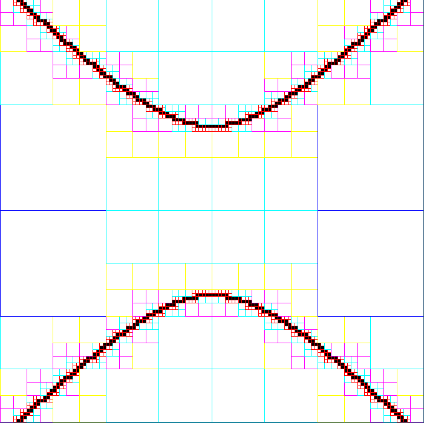
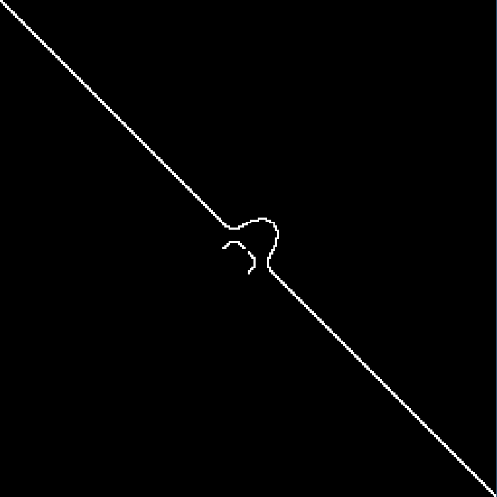

<p align="center" width="100%"></p>

# Visualizador de Funções Implícitas
## Introdução
Este visualizador foi desenvolvido por David de Oliveira Lima para o curso de Estrutura de Dados e Algoritmos da UFBA ministrado pelo professor Antonio L. Apolinário Jr. Este projeto foi desenvolvido para que se assemelhasse com o exemplo apresentado nas instruções do trabalho, porém com algumas mudanças próprias, como a interação com o visualizador em runtime, o acréscimo de exemplos, entre outros.

## A Estrutura
A estrutura de dados escolhida para o desenvolvimento da solução deste trabalho foi a Árvore Quaternária. A escolha se deve graças a possibilidade da representação do espaço de forma particionada a modo que possamos visualizar a função implícita em qualquer resolução de forma efetiva.

## Como a função é desenhada
### Avaliação de pertencimento à curva
Seja f a função que queremos visualizar e (x,y) as coodernadas do vértice v. Para cada vértice v no quadrado que representa o domínio da folha atual, calculamos f(x,y) e avaliamos a magnitude do resultado do cálculo. Se pelo menos um vértice possui magnitude diferente dos outros, subdividimos aquela folha e realizamos este mesmo processo recursivamente para cada filho, até chegarmos ao limite da resolução ou encontrarmos uma folha em que todos os vértices possuam o mesmo sinal.

### Modo de visualização 1
 - Se a folha possui todos os vértices maiores ou menores que 0 em relação a f(x,y), pintamos de branco.
 - Se a folha for frontal (pertence a função), a pintamos de preto.
 - Em todos os casos renderizamos a borda de cor relacionada ao nível daquela folha na árvore.

### Modo de visualização 2
 - Se a folha for frontal, a pintamos de branco. Se não, a pintamos de preto.

### Modo de visualização 3
 - Se a folha possui todos os vértices positivos, a pintamos de azul.
 - Se a folha possui todos os vértices negativos ou for frontal, a pintamos de vermelho. 

## Complexidade
### Construção
A construção da árvore quaternária apresenta complexidade média de O(nlog(n)), O(n²) no pior caso e O(1) no melhor caso. Isso se deve pois é preciso chegar na folha correta para realizar a subdivisão apropriada.

### Visualização
Todas as visualizações apresentam complexidade de O(n²) pois precisamos acessar todas as folhas de todas as sub-árvores.

## Exemplos
O visualizador consta com 8 exemplos:

|                            0                             |                           1                            |                          2                          |                            3                             | 4 |                           5                           |                          6                          |                          7                           |
|:--------------------------------------------------------:|:------------------------------------------------------:|:---------------------------------------------------:|:--------------------------------------------------------:| :---: |:-----------------------------------------------------:|:---------------------------------------------------:|:----------------------------------------------------:|
|  |  |  |  |  |  |  |  |
|                (x² + y² - 4)³ - x² * y³                 |                     x² + y² - 49                      |             x⁷ - y⁵ + x² * y³ - (xy)²              |                        y²- x² - 16                        | x⁴(1-x)⁵ + x + (y²)(1-y) + 0.1 |           x(1-x)(1+x) + y(1-y)(1+y) + 0.1            |        x² + y² + xy - (xy)² * 0.5 - 0.25         |                   x³ + y² - 6xy                   |
 
## Como utilizar o visualizador
Inicie o visualizador executando com o comando ```python3 main.py``` no terminal. Todas as funcionalidades de visualização da aplicação podem ser utilizadas diretamente dentro da aplicação, sem necessidade de executá-la novamente. Uma tabela com todos os controles que podem ser utilizados na aplicação pode ser vista abaixo. Todas as configurações atuais são preservadas quando se troca de função, ou seja, a resolução e o modo de visualização se mantêm quando troca-se de função.

### Tabela de controles

| Tecla              | Descrição              |
|--------------------|------------------------|
| Seta para cima     | Aumentar refinamento   |
| Seta para baixo    | Diminuir refinamento   |
| Seta para direita  | Próxima função         |
| Seta para esquerda | Função anterior        |
| 1                  | Modo de visualização 1 |
| 2                  | Modo de visualização 2 |
| 3                  | Modo de visualização 3 |

## Fontes

 - Documentação do Pyglet, **pyglet**. https://pyglet.readthedocs.io/en/latest/index.html
 - Quadtrees in 30 minutes, **Bill Kerney**. https://www.youtube.com/watch?v=ybCdeu6amQc
 - Quadtree, **Wikipedia**. https://en.wikipedia.org/wiki/Quadtree
 - Quadtree Algorithm for Implicit Curve Drawing, **Shamshad Alam**. http://shamshad-npti.github.io/implicit/curve/2015/10/08/Implicit-curve/
 - Approximation of ImplicitCurves Using the Bad Edge Refinement Concept, **Esther J. Moet**. https://fse.studenttheses.ub.rug.nl/8872/1/Infor_Ma_2003_EJMoet.CV.pdf
